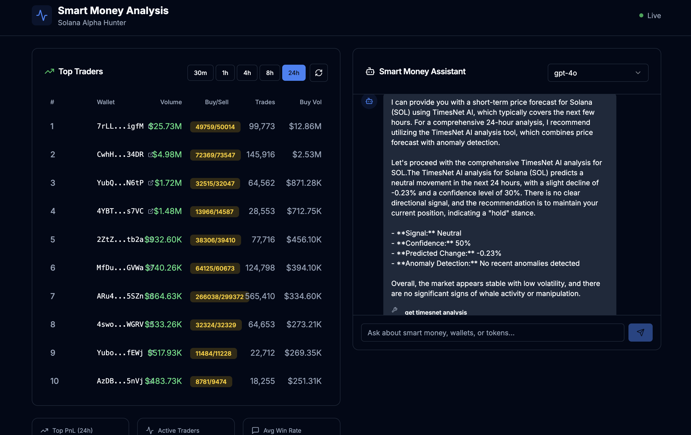

# 项目名称

chat2chain

## 💻 项目 Repo

https://github.com/unive3sal/smart-money-analysis

## 📌 项目简介

这是一个 solana 上的聪明钱交易分析工具。用户可以与大模型交互，得知当前 solana 上的 top traders
交易信息，并分析出交易策略，结合时间序列预测模型给出投资建议。同时捕捉社交媒体上的热点与市场情绪，
不错过任何一个潜在机会！

## 🛠️ 技术栈

- 前端：Next.js + React + TypeScript + TailwindCSS
- 后端：Next.js + API Routes + TypeScript
- AI Agent：Google Agent Development Kit
- 数据获取：Birdeye API + LunarCrush + DexScreener
- 时间序列预测: python + FastAPI + pytorch + TimesNet

### 演示链接

- 🌐 在线 Demo：https://chat2chain.noman.work

### 功能截图

## 💡 核心功能

1. 聪明钱排行榜（Smart Money Leaderboard）：按交易量在不同时间窗口（1h、4h、12h、24h）追踪顶级交易者
2. 钱包分析（Wallet Analysis）：深入分析钱包持仓、交易记录与交易行为模式
3. 特征提取（Feature Extraction）：提取结构化指标，用于刻画交易行为、绩效表现与风险画像
4. 置信度评分（Confidence Scoring）：综合分析聪明钱活动、媒体情绪与风险因子，输出综合置信度评分
5. AI 聊天助手（AI Chat Assistant）：支持多模型 LLM（GPT-4、Claude、Gemini）的流式对话界面
6. 媒体情绪（Media Sentiment）：通过 LunarCrush 与 DexScreener 追踪社交/市场情绪
7. TimesNet AI 分析（TimesNet AI Analysis）：使用深度学习进行价格预测与异常检测

## ✍️ 项目创作者：

1. 创作者昵称 Julien
2. 创作者联系方式 telegram@univ3r53
3. 创作者 Solana USDC 钱包地址 86jeBwneog7scAqHHGYZ1U3Yq2p79jgbS2ZriJ4zoXrb

